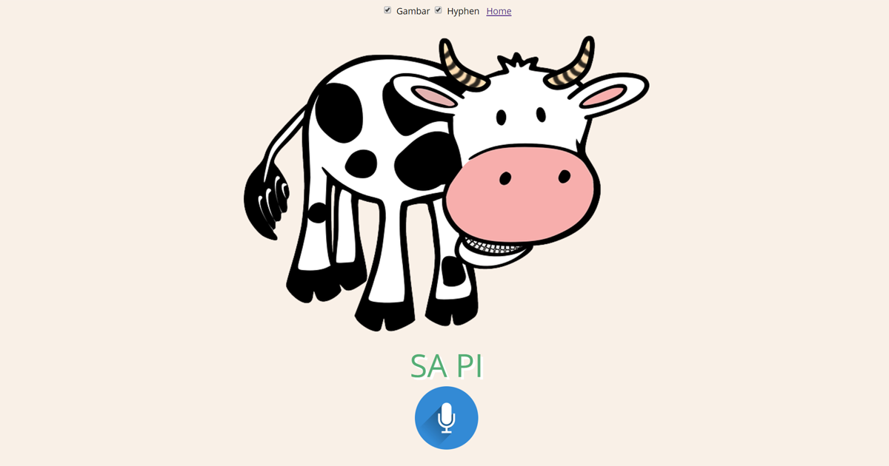

# Kids Voice Recognition Game (2+)

Allow kids from 2+ to learn to recognize objects and read words by using voice recognition, using just static HTML pages.

See the game live at: **https://bennylp.github.io/KidsVoiceRecognition/**

Requires browser with HTML5 voice recognition: 
- Android:
  - Chrome
  - Samsung Internet
- Mac:
  - Chrome
- Windows
  - Chrome
- iOS:
  - nothing works

## Credits

- Images: 
    - https://pixabay.com/users/MostafaElTurkey36-13328910/
    - https://media1.tenor.com/images/0fd559b07f2174f9b8b7dbde7c5a67ca/tenor.gif?itemid=8715614
    - https://pixabay.com
- Sounds: 
    - https://freesound.org/
- Animations: 
    - Confetti: https://www.iprodev.com/confetti-animation-javascript/
